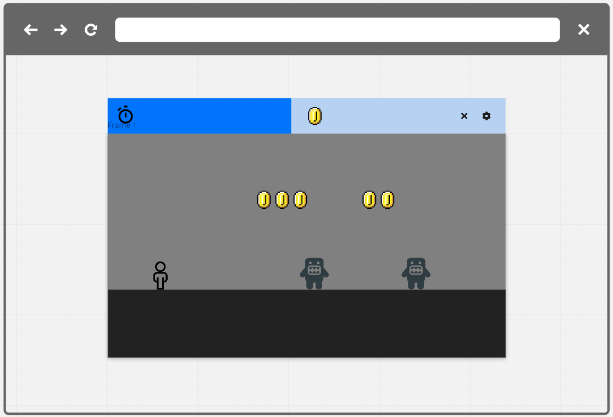
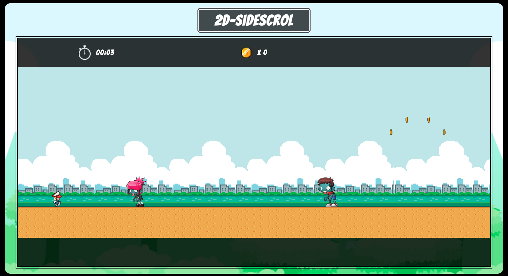

# 2D-SideScrol

Simple video games always send me back to childhood. Many popular games today emphasize complexity and realism, but some of the games that provided me with the most enjoyment were quite simple. As an homage to those earlier, albeit not the earliest, generations of video games, this will be a side-scrolling game of survival. Emulating classics that graced early consoles and machines running the likes of Windows 95, users will control a playable character collecting some nondescript form of currency and avoiding the bad guys. 

## Technologies Used
+ The game page HTML elements were laid out and styled with CSS 
+ A combination of Flexbox and Grid were used for positioning
+ Javascript was used for DOM manipulation to change the text displayed and for canvas manipulation
+ An html canvas element was utilized for gameplay rendering, with collision detection and sprites for gamepiece animations
+ Adobe illustrator was used for editing assets and creating spritesheets

## Development Approach
<!-- wireframe -->
***
Initial wireframe

***

The general workflow began with laying out objectives for a minimum viable product, to first build a functioning game. 

+ Start screen with understandable instructions
	- DOM manipulation and css animation
+ User controllable character via arrow keys
	- Boolean object container with keyboard events
+ NPC movement (right to left in varying speeds for mvp, requiring user to maneuver around them as they collect coins)
	- Object manipulation with gamepiece object classes and canvas rendering 
+ Timer/Scoretracker
	- Javascript interval with counter function and DOM manipulation for display
+ End game conditions with collision detection (game ends if PC collides with NPC)
	- Axis aligned bounding boxes with conditionals for collision detection, triggering endgame function
+ Reset capability
	- Initializer function linked by event listener to button and keyboard events
	- Invoked post endgame function, resets variables to replayable state with text prompts

Once the fundamental functionality of the gameplay was achieved, the page was styled to be more aesthetically pleasing using images, fonts, and improved proportions for positioning, before moving onto additional functional components. Code was refactored throughout the development process, but especially after achieving the functionality components of mvp, to minimize line count and increase modularity. Some of the stretch goals were achieved, including adding some variance to npc movement, pc movement being limited by gravity simulation, and a moving background. Thereafter, sprite sheets were used to add more appeal to the action of gameplay, making the playable character and other game objects appear more dynamic. 

***
Product screenshot

***

[link to game](https://philjang.github.io/2D-SideScrol/)

## Sample Code Block

```javascript
// object class for game pieces
class gamePiece {
    constructor(inputX, inputY, inputW, inputH, inputS, inputI, inputSW, inputSH) {
        this.xpos = inputX;
        this.ypos = inputY;
        this.width = inputW;
        this.height = inputH;
        this.speed = inputS;
        this.image = inputI;
        this.srcW = inputSW;
        this.srcH = inputSH;
    }

    // method to render for each frame
    render() {
	// drawImage(newimagevar, srcX, srcY, srcW, srcH, x, y, w, h)
        ctx.drawImage(this.image, srcXPC, 0, this.srcW, this.srcH, this.xpos, this.ypos, this.width, this.height);
    }

    // dictates movement
    move() {
        this.xpos -= this.speed;
    }
    detectHit() {
        // axis-aligned bounding box
        // compare relation of pc and this npc
        const pcRight = pc.xpos + pc.width >= this.xpos;
        const pcLeft = pc.xpos <= this.xpos + this.width;
        const pcTop = pc.ypos <= this.ypos + this.height;
        const pcBottom = pc.ypos + pc.height >= this.ypos;
        // if all 4 true, then there is collision
        if (pcRight && pcLeft && pcTop && pcBottom) {
            return true;
        } else return false;
    }
}

pc.move = () => {
	const speed = 10; // set increment value to move per keydown
	if (keysDown.ArrowLeft) pc.xpos -= speed;
	if (keysDown.ArrowRight) pc.xpos += speed;
	// gravity simulation
	if (pc.ypos === 400 && keysDown.ArrowUp) {
		pc.jumpTime = 0.01;
		pc.ypos = 400 + (-100 * pc.jumpTime + 10 * pc.jumpTime ** 2);
	}
	if (pc.ypos < 400) {
		pc.jumpTime += 0.7;
		pc.ypos = 400 + (-100 * pc.jumpTime + 10 * pc.jumpTime ** 2);
	}
	if (pc.ypos > 400) pc.ypos = 400; // prevents overshoot from gravity
};
```

### Unsolved problems

Some of the stretch goals yet to be achieved include adding a decrementing health component, environmental obstacles, and a more dynamic background setting. The game also has some potential for elaboration using additional game pieces (e.g. power-up items and tools) or adding a high-score tracker. It would also benefit from improved visual design as well as further variance in graphics animations and gamepiece movement. Accessibilty and viability for different sizes of screens and forms of input have yet to be addressed. 

### Resources
+ Animate.css 
+ Google fonts 
+ itch.io and gameart2d.com for game assets
+ MDN and W3schools for canvas and sprite tutorial